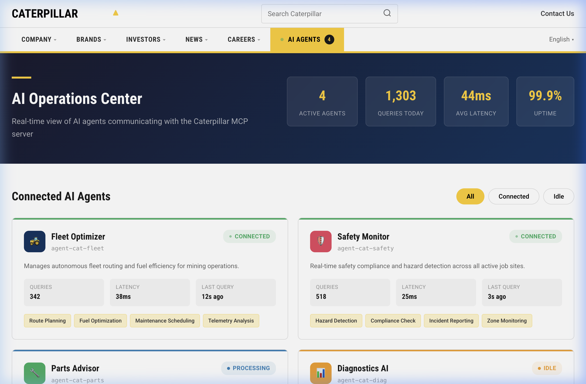
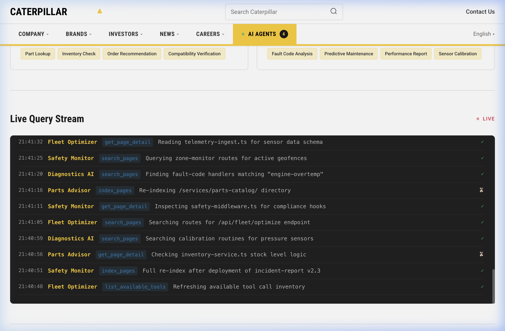

# 🚜 hackIlli26_CatterPillar

> **Caterpillar MCP Server + AI Agents Dashboard** — HackIllinois 2026

An MCP (Model Context Protocol) server that indexes Node.js codebases, paired with a Caterpillar.com-inspired web frontend featuring a real-time **AI Agents Dashboard**.

---

## 🖥️ AI Operations Dashboard





---

## ✨ Features

### MCP Server (TypeScript)
| Capability | Details |
|---|---|
| **Tools** | `index_pages` · `search_pages` · `get_page_detail` · `list_available_tools` |
| **Resources** | `pages://index` · `pages://detail/{filePath}` |
| **Prompts** | `summarize_project` · `analyze_routes` |

- 📂 Scans any Node.js project directory for `.js`, `.ts`, `.jsx`, `.tsx`, `.html` files
- 🔍 Detects frameworks: **Express**, **Next.js**, **Koa**, **Hapi**, **Fastify**
- 🗺️ Extracts routes, exports, dependencies, and LOC
- 📁 Writes a `.mcp/` context directory with structured JSON metadata
- 🔌 Runs over **stdio** transport for any MCP-compatible client

### Web Frontend — AI Agents Tab
- **4 AI Agents**: Fleet Optimizer, Safety Monitor, Parts Advisor, Diagnostics AI
- **Live Query Stream**: Real-time MCP tool call log with timestamps and status
- **Query Types Breakdown**: 8 categories with volume metrics and progress bars
- **MCP Tools Catalog**: Interactive display of available server tools
- **Caterpillar Branding**: `#FFCD11` yellow palette, Roboto Condensed typography, two-tier nav

---

## 🚀 Quick Start

### Prerequisites
- Node.js 18+
- npm

### Install & Build
```bash
git clone https://github.com/atharva789/hackIlli26_CatterPillar.git
cd hackIlli26_CatterPillar
npm install
npm run build
```

### Run the MCP Server
```bash
# Index a Node.js project
npm start -- --directory /path/to/your/project

# Or use tsx for development
npm run dev -- --directory ./src
```

### Open the Web Dashboard
```bash
open web/index.html
```
The AI Agents tab loads by default showing all connected agents and the live query stream.

---

## 📁 Project Structure

```
├── src/                      # MCP Server (TypeScript)
│   ├── index.ts              # Entry point (stdio transport)
│   ├── server.ts             # Tool/resource/prompt registration
│   ├── indexer/
│   │   ├── types.ts          # PageInfo, RouteInfo, IndexResult
│   │   ├── scanner.ts        # Directory walker (glob)
│   │   └── parser.ts         # File metadata extractor
│   ├── context/
│   │   └── contextDir.ts     # .mcp/ context directory manager
│   └── tools/
│       ├── indexPages.ts     # Scan & index tool
│       ├── searchPages.ts    # Query tool
│       ├── getPageDetail.ts  # Detail + preview tool
│       └── listTools.ts      # Self-documenting manifest
├── web/                      # Caterpillar Web Frontend
│   ├── index.html
│   ├── styles.css
│   └── app.js
└── docs/                     # Screenshots
```

---

## 🛠️ MCP Tools Reference

### `index_pages`
Scan and index all Node.js pages in a target directory. Creates `.mcp/` context directory.
```json
{ "directory": "/path/to/project" }
```

### `search_pages`
Search indexed pages by query, framework, or type.
```json
{ "query": "auth", "framework": "express", "type": "route" }
```

### `get_page_detail`
Get full metadata and source preview for a specific page.
```json
{ "filePath": "src/routes/users.ts" }
```

### `list_available_tools`
Returns all available MCP tools with schemas. No parameters.

---

## 🏗️ Built With

- **[Model Context Protocol](https://modelcontextprotocol.io)** — Open protocol for LLM ↔ tool integration
- **TypeScript** + `@modelcontextprotocol/sdk` v1
- **Vanilla HTML/CSS/JS** — Caterpillar-themed frontend
- **Zod** — Input schema validation
- **Glob** — File system scanning

---

## 📄 License

MIT
