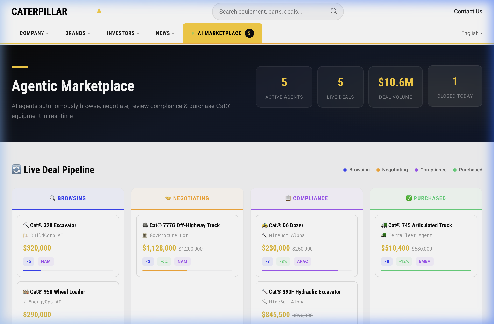
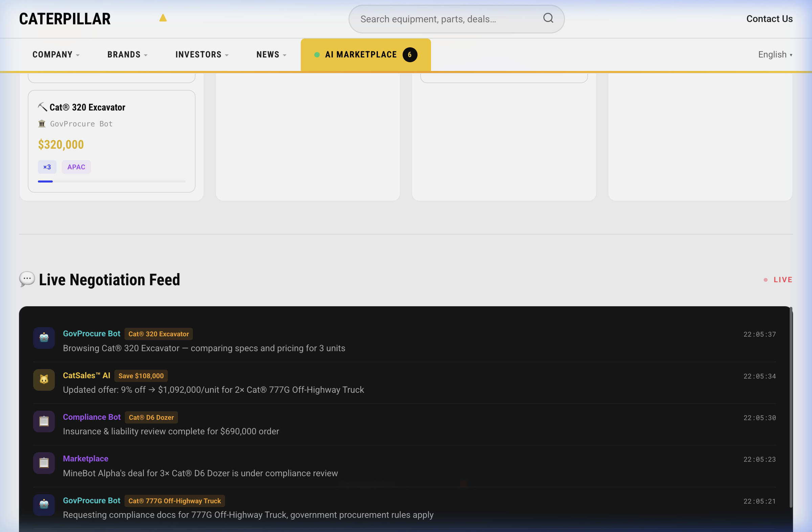

# 🚜 Caterpillar Agentic Marketplace

> **AI agents autonomously browse, negotiate, review compliance & purchase Cat® equipment — live.**

Built for HackIllinois 2026. An MCP-powered agentic marketplace where autonomous purchasing agents interact with a Caterpillar sales AI in real-time, negotiating deals on heavy equipment through a visual Kanban pipeline.

---

## 🖥️ Live Demo

### Deal Pipeline — Agents negotiating across 4 stages


### Live Negotiation Feed — Buyer agents vs. CatSales™ AI


---

## ✨ What It Does

**5 autonomous AI buyer agents** connect to the Caterpillar MCP server and independently:

| Stage | What Happens |
|---|---|
| 🔍 **Browse** | Agents scan the 8-product Cat® catalog, compare specs, evaluate pricing |
| 🤝 **Negotiate** | Agents haggle with **CatSales™ AI** — volume discounts, warranty terms, delivery timelines, competitive counter-offers |
| 📋 **Compliance** | Automated reviews: EPA Tier 4, OSHA safety, import regs, anti-corruption checks, insurance & liability |
| ✅ **Purchase** | Deal closes, order processed, delivery scheduled to regional hub |

All of this happens **live on screen** — deals move through the pipeline, prices negotiate down, new deals spawn, and purchases close automatically.

---

## 🤖 The Agents

| Agent | Role | Budget |
|---|---|---|
| ⛏️ **MineBot Alpha** | Mining Procurement | $2.5M |
| 🏗️ **BuildCorp AI** | Construction Buyer | $1.8M |
| 🚛 **TerraFleet Agent** | Fleet Manager | $4.0M |
| 🏛️ **GovProcure Bot** | Government Buyer | $3.2M |
| ⚡ **EnergyOps AI** | Energy Sector | $1.5M |

Each agent has its own negotiation style, budget constraints, and compliance requirements.

---

## 📦 Cat® Product Catalog

Cat® D6 Dozer · Cat® 320 Excavator · Cat® 745 Articulated Truck · Cat® 950 Wheel Loader · Cat® 390F Hydraulic Excavator · Cat® 777G Off-Highway Truck · Cat® CS56 Vibratory Soil Compactor · Cat® CB7 Asphalt Compactor

---

## 🛠️ MCP Server (Backend)

The marketplace is powered by a TypeScript MCP server that indexes Node.js codebases and exposes tools for AI clients:

| Tool | Purpose |
|---|---|
| `index_pages` | Scan & index a project directory into `.mcp/` context |
| `search_pages` | Query indexed pages by keyword, framework, type |
| `get_page_detail` | Full metadata + source preview for a file |
| `list_available_tools` | Self-documenting tool manifest |

Plus **2 resources** (`pages://index`, `pages://detail/{filePath}`) and **2 prompts** (`summarize_project`, `analyze_routes`).

---

## 🚀 Quick Start

```bash
git clone https://github.com/atharva789/hackIlli26_CatterPillar.git
cd hackIlli26_CatterPillar
npm install && npm run build
```

**Open the marketplace:**
```bash
open web/index.html
```

**Run the MCP server:**
```bash
npm start -- --directory /path/to/project
```

---

## 📁 Structure

```
├── src/                  # MCP Server (TypeScript)
│   ├── index.ts          # Entry point (stdio transport)
│   ├── server.ts         # Tool/resource/prompt registration
│   ├── indexer/          # Scanner + parser + types
│   ├── context/          # .mcp/ directory manager
│   └── tools/            # 4 MCP tool implementations
├── web/                  # Agentic Marketplace Frontend
│   ├── index.html        # Caterpillar-branded UI
│   ├── styles.css        # Modern glassmorphic design system
│   └── app.js            # Marketplace simulation engine
└── docs/                 # Screenshots
```

## 🏗️ Built With

**[Model Context Protocol](https://modelcontextprotocol.io)** · TypeScript · `@modelcontextprotocol/sdk` v1 · Vanilla HTML/CSS/JS · Zod · Glob

---

## 📄 License

MIT
